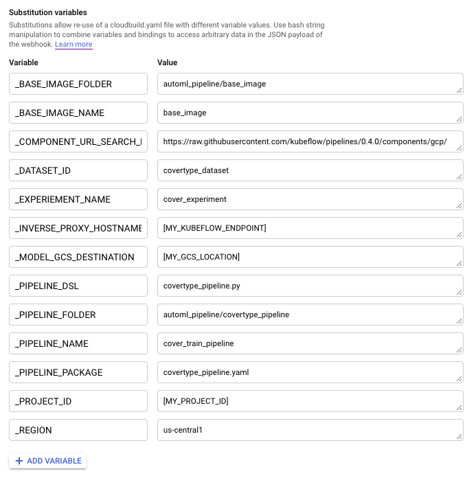

## End-to-End BigQuery and AutoML Tables Tutorial


## Content Overview

In this tutorial, we designed a Kubeflow pipeline which leverages BigQuery for data preprocessing and AutoML
Tables for model training. The Kubeflow pipeline consists of the following steps:

* Create a base docker image for the custom lightweight KFP components
* Compile the KFP pipeline
* Upload the pipeline version and optionally run the pipeline

## Setup

### Creating a KFP CLI image

We need to create a custom image that encapsulates KFP CLI. 
This image will be used in Cloud Build steps to interact with the KFP environment.

Build the image and push it to your project's Container Registry.

Run the following commands in the `kfp_image` folder:
```
KFP_IMAGE_URI="gcr.io/${PROJECT_ID}/kfp-cli"
gcloud builds submit --timeout 15m --tag ${KFP_IMAGE_URI} .
```

### Copy the BigQuery CoverType dataset

The sample pipeline uses the Cover dataset, which can be found at `kubeflow-pipeline-fantasy:covertype_dataset`.
This BigQuery dataset should be copied to your own project.


### Setup Environment Variables

To run the pipeline in local machine, first you need to set the following environment variables:
```
export PROJECT_ID=$(gcloud config get-value core/project)
export REGION=[YOUR AUTOML DATASET REGION]
export ZONE=[YOUR GKE CLUSTER ZONE]
export GKE_CLUSTER_NAME=[YOUR GKE CLUSTER]
export NAMESPACE=default
export DATASET_ID=covertype_dataset
export MODEL_GCS_DESTINATION=[GCS LOCATION FOR EXPORTED MODEL]

gcloud container clusters get-credentials $GKE_CLUSTER_NAME --zone $ZONE
export INVERSE_PROXY_HOSTNAME=$(kubectl describe configmap inverse-proxy-config -n $NAMESPACE | grep "googleusercontent.com")
```

## Trigger the pipeline locally

To trigger the pipeline on your local machine, run the following command:
```
export TAG_NAME=0.0.1
./build_pipeline.sh
```

The above simulates a GitHub trigger locally with a TAG_NAME environment variable.

## Trigger the pipeline from GitHub

To trigger the pipeline from GitHub automatically, we need to 
[create a GitHub App trigger](https://cloud.google.com/cloud-build/docs/automating-builds/create-github-app-triggers)
in Cloud Console.

In this example the trigger will be fired if there is a new tag being pushed to any branch
of the project repository in GitHub. We could use a regular expression to filter the tags
so only tags matching the pattern can trigger the build. Here we use `.*` to cover all tags.


For this AutoML pipeline, the cloud build config file is `automl_pipeline/cloudbuild.yaml`.


Finally, we need to specify the variable substitutions to replace the environment variables
used in `cloudbuild.yaml`. 
The variables are almost the same as the one used in local script `bulid_pipeline.sh`.
Note that we do not need to specify the `TAG_NAME` variable here, because that will be
automatically populated by Cloud Build using the tag name detected from the trigger.



Finally, we can test the trigger by pushing a tag to the GitHub repository. 
If everything goes well, you should be able to see a new build running in the 
[Cloud Build History page](https://console.cloud.google.com/cloud-build/builds).
Once the build is completed successfully, the pipeline run should appear in the 
Kubeflow Pipeline dashboard under the Experiments tab. It will take some time for the 
pipeline to complete as AutoML Tables needs at least one node hour to train a model.

