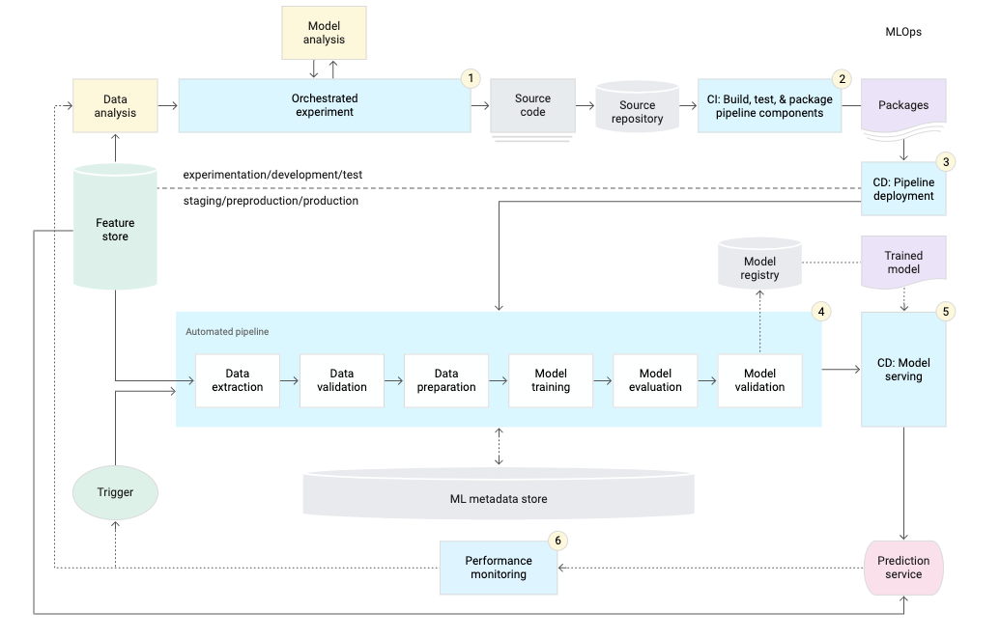

# Kubeflow Pipeline CI/CD Examples

MLOps is an ML engineering culture and practice that aims at unifying ML 
development (Dev) and ML operation (Ops). MLOps strongly advocates automation 
and monitoring at all steps of ML system construction, from integration, testing, 
and releasing to deployment and infrastructure management.

Kubeflow Pipeline that orchestrating the ML tasks is only one part of the
recommended MLOps pipeline, which includes e.g.
- Source control
- Test and Build services
- Deployment services
- Model Registry
- Feature Store
- ML Metadata DB
- ML Pipeline Orchestrator

The following diagram shows the implementation of the ML pipeline using CI/CD, 
which has the characteristics of the automated ML pipelines setup plus the automated CI/CD routines.

- [CI/CD Pipeline with AutoML](CICD_Pipeline_with_AutoML): In this tutorial, we 
designed a Kubeflow pipeline which leverages BigQuery for data preprocessing and AutoML
Tables for model training. The Kubeflow pipeline consists of the following steps:
    * Create a base docker image for the custom lightweight KFP components
    * Compile the KFP pipeline
    * Upload the pipeline version and optionally run the pipeline
    
- [CI/CD Pipeline with AI Platform](CICD_Pipeline_with_AI_Platform): This lab 
uses the [Covertype Dat Set](https://archive.ics.uci.edu/ml/datasets/covertype). 
In this exercise you walk-through authoring a **Cloud Build** CI/CD workflow that automatically builds and deploys a KFP pipeline. 
The CI/CD workflow automates the steps:
    * Builds the trainer image
    * Builds the base image for custom components
    * Compiles the pipeline
    * Uploads the pipeline to the KFP environment
    * Pushes the trainer and base images to your project's **Container Registry**
